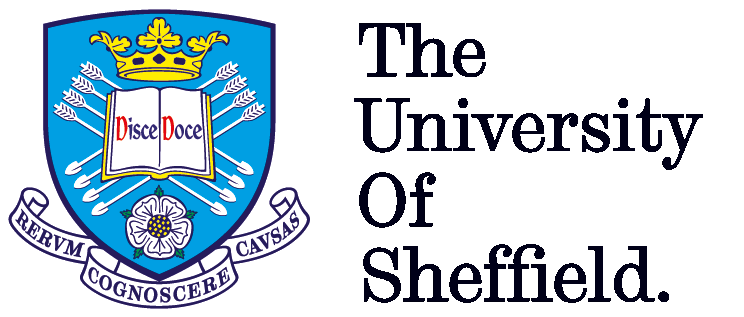

We are a multi-displinary and multi-institution research team working towards COVID-19 research. To prevent further waves of the COVID-19 pandemic, it is vital to identify and isolate individuals who are asymptomatic or present with a few symptoms and carry the SARS-CoV-2 virus. Our group is working towards developing  prediction models that combine several variables from routine tests can be used to identify patterns in individuals who are infected but show no or few symptoms. This type of model can support medical decision making when allocating limited healthcare resources. 

## Fellowship of the Pandemic
###	University of Brighton
* [Louise Mackenzie](https://research.brighton.ac.uk/en/persons/louise-mackenzie)
* [Simonne Weeks](https://research.brighton.ac.uk/en/persons/simonne-weeks) 

### University of Glasgow
* [Surajit Ray ](https://www.gla.ac.uk/schools/mathematicsstatistics/staff/surajitray/)

### University of Oxford
* [Abhirup Banerjee](http://users.ox.ac.uk/~card0439/)

### University of Lincoln
* [Dr Bart Vorselaars](https://staff.lincoln.ac.uk/bvorselaars)

### University of Sheffield
* [Andy Swift](https://www.sheffield.ac.uk/medicine/people/iicd/andrew-swift)
* [Michail Mamalakis](https://www.linkedin.com/in/michail-mamalakis-583787a9/?originalSubdomain=gr)

## Partner institutions

---
{:height="50px"}  {:height="50px"}  {:height="50px"} {:height="50px"} {:height="50px"} 

---

